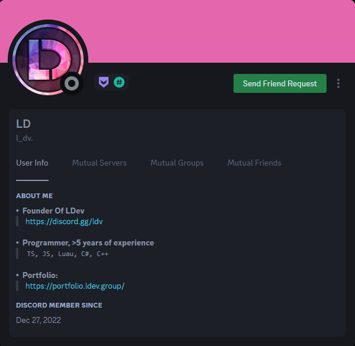
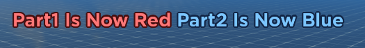

# Introduction

## About Me

I am a **Full-Stack** lua **programmer** from Poland. I have **over 5 years** of programming experience. My timezone is `GMT+1`. I also code in `JS`, `TS` and `C#`.

## Impersonators

!> ALWAYS MAKE SURE THAT YOU ARE TALKING TO THE RIGHT PERSON! MAKE SURE DISCORD ACCOUNT YOU ARE DEALING WITH HAS CORRECT ID: `972018685826981918`. I THIS CASE BOTH BADGES, DESCRIPTION AND MY BANNER COLOR WERE ALL COPIED, ONLY DIFFERENCE IS THE ID AND THE . (dot) IN THE USERNAME.
</img>

## Informations

### Payment
- Pay Range
  - **Per Hour:** $25/h **-** $50/h
  - **Paid Per Task:** $100+
- Payment Methods
  - **Crypto -** *(10% OFF)* **BTC, ETH, XMR, USDC, USDT, SOL, BNB**
  - **PayPal -** *(F&F)*
  - **Robux -** *(devex rates)* **Group Payout**

?> **50% Upfront**

!> **Minimum Order:** $350 **/** R$100,000

---

### Contact
- Discord
  - **l_dv** `972018685826981918`
- Twitter
  - **@LDev_ROBLOX**

# Object Oriented Programming

Object Oriented Programming (OOP) allows faster and cleaner workflow by reusing same function from multiple different sources which makes applying any changes/fixes easier.

## Frameworks

?> I work with mainstream frameworks and modules which helps other programmers edit and add new features to my existing work. On top of that my code is clear and easy to understand even for beginners.

### Knit

**Knit** is a ROBLOX game framework which makes communication between client and server alot faster to code by avoiding creating remote events manually. Most ROBLOX programmers use `Knit` which makes it perfect framework for big projects with multiple programmers.

#### Creating Service
```lua
-- [[ Service ]] --
local ServerService = Knit.CreateService {
	Name = script.Name;
	TexturesPerPlayer = {};
	Client = {
        UpdateTexture = Knit.CreateSignal();
        Texture = Knit.CreateProperty(1);
    };
}
```
#### Service Functions
```lua
function ServerService:GetUnlockedTextures(player)
	return DataManager:getData(player).GameData.textures
end

function ServerService.Client:GetUnlockedTextures(player)
	return self.Server:GetUnlockedTextures(player)
end
```
#### Service Initialization
```lua
function ServerService:KnitStart()
	-- [[ Services ]] --
	DataManager = Knit.GetService("DataManager")
	-- [[ Setup ]] --
	local function onPlayerAdded(player)
		self.TexturesPerPlayer[player] = {TextureId = 1}
	end
	local function onPlayerRemoving(player)
		self.TexturesPerPlayer[player] = nil
	end
	-- [[ Init ]] --
	for _,player in ipairs(Players:GetPlayers()) do
		coroutine.wrap(onPlayerAdded)(player)
	end
	Players.PlayerAdded:Connect(onPlayerAdded)
	Players.PlayerRemoving:Connect(onPlayerRemoving)
end

return ServerService
```

## Front-End Programming

**Front-End** is the client-sided code which includes: `animations`,`visual effects`,`sound effects`,`user interface`and more. Well written client-sided code results in better performace. Alot of server-sided systems can be moved to client in order to lower network traffic, make animations smoother and improve server performance.

### Custom Healthbars

**Custom Healthbars** - interactive, efficient and customizable `module` enhancing the looks of healthbars.

[filename](_media/healthbars.mp4 ':include :type=video controls width=100%')

### Quests System

**Quests System** - well animated and functional quests system used in my game `Lumber Legends`

[filename](_media/user_interface_1.mp4 ':include :type=video controls width=100%')

### In-Game Purchases Handler

**In-Game Purchases Handler** - hides unnecessary UI elements, which helps player focus on the purchase.

[filename](_media/purchase_handling.mp4 ':include :type=video controls width=100%')

### RichText2

**XML markdown** allows for more control over the displayed text such as multiple colors in a single TextLabel but is very annoying to do manually which is why I developed "RichText2" module which with simple API can save programmers alot of time

```lua
local RichText2 = require(Knit.Util.RichText2);

local RichText2Object = RichText2.new(textLabel)
local Part1 = RichText2Object.AddText("Part1 Is Blue!")
local Space = RichText2Object.AddText(" ")
local Part2 = RichText2Object.AddText("Part1 Is Red!")
	
Part1.AddFont(Color3.fromRGB(124, 198, 255))
Part1.AddStroke(Color3.fromRGB(18, 38, 70), "bevel", 4, 0)
	
Part2.AddFont(Color3.fromRGB(255, 119, 119))
Part2.AddStroke(Color3.fromRGB(70, 15, 16), "bevel", 4, 0)
	
task.wait(2)
	
Part1.SetText("Part1 Is Now Red")
Part1.AddStroke(Color3.fromRGB(70, 15, 16), "bevel", 4, 0)
Part1.AddFont(Color3.fromRGB(255, 119, 119))
	
Part2.SetText("Part2 Is Now Blue")
Part2.AddFont(Color3.fromRGB(124, 198, 255))
Part2.AddStroke(Color3.fromRGB(18, 38, 70), "bevel", 4, 0)
```

This long string that would normally need to be written manually was generated by just couple lines of code:
```
<stroke color="rgb(18, 38, 70)" joins="bevel" thickness="4" transparency="0"><font color="rgb(124, 198, 255)">Part1 Is Blue!</font></stroke> <stroke color="rgb(70, 15, 16)" joins="bevel" thickness="4" transparency="0"><font color="rgb(255, 119, 119)">Part1 Is Red!</font></stroke>
```
</img>

This long string that would normally need to be written manually was generated by just couple lines of code:
```
<stroke color="rgb(70, 15, 16)" joins="bevel" thickness="4" transparency="0"><font color="rgb(255, 119, 119)">Part1 Is Now Red</font></stroke> <stroke color="rgb(18, 38, 70)" joins="bevel" thickness="4" transparency="0"><font color="rgb(124, 198, 255)">Part2 Is Now Blue</font></stroke>
```
</img>

### FormatNumber

#### Formatting
**Format Number** helps with advanced and fast formatting of numbers. Used for all sorts of games in order to display numbers easily readable by players. Works along `BigNum` module.
```lua
local abbreviations = FormatNumber.Notation.compactWithSuffixThousands({
	"k", "M", "B", "T", "qd", "qn", "sx", "sp", "o", "n", "d", "ud", "dd", "td", "qtd", "qnd", "sxd", "spd", "od", "nd", "vg",
})
local formatter = FormatNumber.NumberFormatter.with():Notation(abbreviations):Precision(FormatNumber.Precision.integer():WithMinDigits(3))
```

| Not Formatted Number |  | Formatted Number |
| :----------: |:------------:| :-----------:|
| **6000**         | <kbd>&rarr;</kbd>           | **6k**          |
| **9530**         | <kbd>&rarr;</kbd>           | **9.53k**          |
| **3562344845**         | <kbd>&rarr;</kbd>           | **3.56B**          |
| **546563434484554554645**         | <kbd>&rarr;</kbd>           | **546qn**          |

### Roact *(soon)*

## Back-End Programming

**Back-End** is the server-sided code which includes: `data storing`,`managing currencies`,`setting up gameplay` and more. Well written server-sided code results in better server performace. 

### Profile Service

**Profile Service** handles storing data on roblox servers, it prevents writing data from multiple servers at once which prevents duplicating items.

#### Default Data Module
This module will be used as template for creating player data and storing it.
```lua
return {
	GameData = {
		["_Security"] = {
			rank = "Player";
			warns = {};
			permBanned = false;
			tempBanned = 0;
			verifiedTwitter = false
		};
		
		["_Values"] = {
			cash = "0";
			silver = "0";
			level = "1";
			experience = "0";
		};
		
		["_Settings"] = {
			lowDetail = false;
			showOthersBackpack = false;
			showOthersPets = false;
			sfx = 0.5;
			music = 0.5;
		};
	};
}
```
#### Replicating Data
Data is stored on server but for faster access to it on client it's good to replicate some insensitive data onto client.
Another thing is creating leaderstats with scores which has to be updated live as values change.
```lua
--replicate leaderstats
if not leaderstatsCreated[Player] then leaderstatsCreated[Player] = {} end
	for Stat, Value in pairs(PlayerProfile.GameData._Values) do
		if table.find(OnLeaderstats, Stat) then
			if not leaderstatsCreated[Player][Stat] then
				local NewValue = Instance.new("StringValue")
				NewValue.Name = (Stat:gsub("^%l", string.upper))
				NewValue.Value = formatter:Format(tonumber(Value))
				NewValue.Parent = Player:WaitForChild("leaderstats")
					
				leaderstatsCreated[Player][Stat] = {
					["Instace"] = NewValue
				}
					
			elseif leaderstatsCreated[Player][Stat] then
				leaderstatsCreated[Player][Stat].Instace.Value = formatter:Format(tonumber(Value))
			end
		end
	end
end
```
#### Global Events
**Profile Service** also helps with handling global events which are used for creating systems of gifting itmes to offline players or trading with players on different servers.
```lua
--get global updates
local globalUpdates = PlayerProfile.GlobalUpdates
--get all already exisisting active updates
for i,update in ipairs(globalUpdates:GetActiveUpdates()) do
	globalUpdates:LockActiveUpdate(update[1])
end
--get all already exisisting locked updates
for i,update in ipairs(globalUpdates:GetLockedUpdates()) do
	handleLockedUpdate(globalUpdates, update)
end
--listen for new active updates
globalUpdates:ListenToNewActiveUpdate(function(id, data)
	local update = {id, data}
	globalUpdates:LockActiveUpdate(update[1])
end)
--listen for new locked updates	
globalUpdates:ListenToNewLockedUpdate(function(id, data)
	local update = {id, data}
	handleLockedUpdate(globalUpdates, update)
end)
```

### BigNum

**BigNum** allows you to store as well as perform operations on `128-bit` numbers, which pretty much eliminates the issue with `64-bit` numbers limiting highest number that can be stored and operated on by server.

`64-bit` signed int cannot be higher than `9,223,372,036,854,775,807` or lower than `-9,223,372,036,854,775,807` which isnt the case for `128-bit`.

#### Operations on BigNum Values
```lua
function ServerService:GiveCurrency(player, amount, skipGamepass)
	local data = DataManager:getData(player)
	if not skipGamepass and table.find(ReciptsHandler.Gamepasses[player], "Double_Coins") then
		amount = tostring(BigNum.new(amount) * BigNum.new(2))
	end
	data.GameData.values.coins = tostring(BigNum.new(data.GameData.values.coins) + BigNum.new(amount))
	DataManager:Replicate(player)
	self.Client.Coins:SetFor(player, data.GameData.values.coins)
	self.Client.CoinFX:Fire(player, amount)
end
```

# IDE And Version Management

?> **IDE:** `Visual Studio Code`.

?> **Version Management:** `Git` workflow which allows me to work with other programmers without interrupting them in unnecessary ways.

> I can use `Rojo` if I am the committing programmer or working solo.

# Math *(soon)*

## Functions